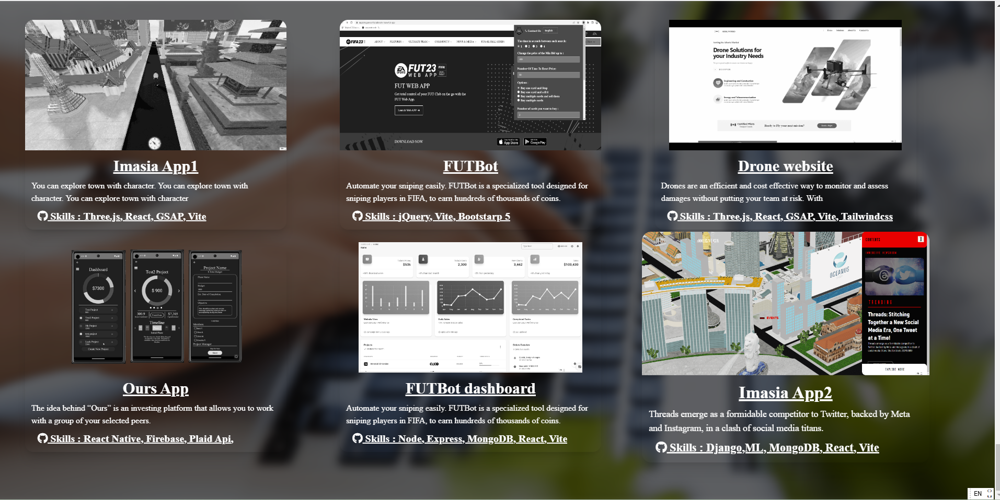
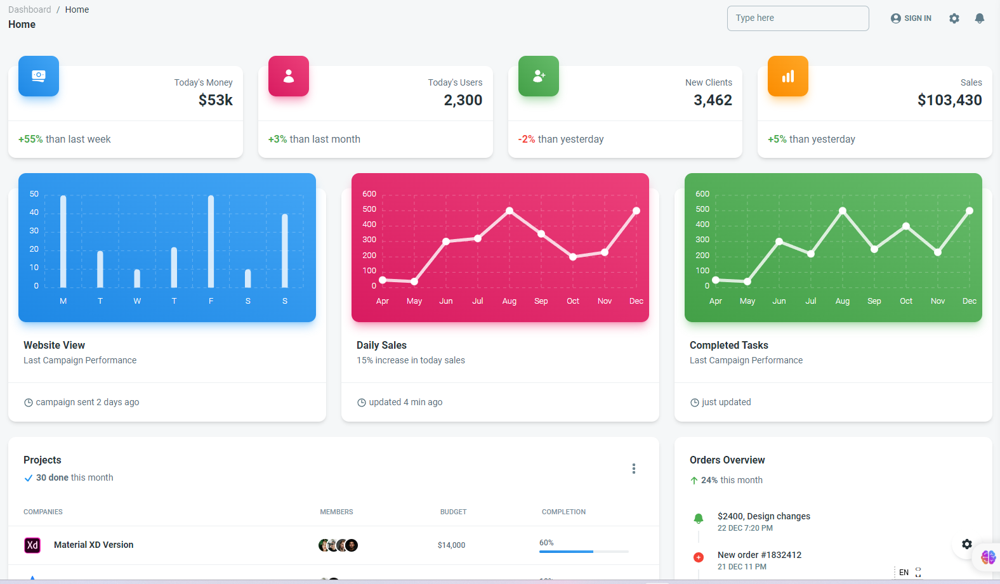
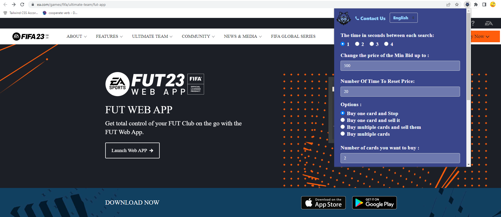
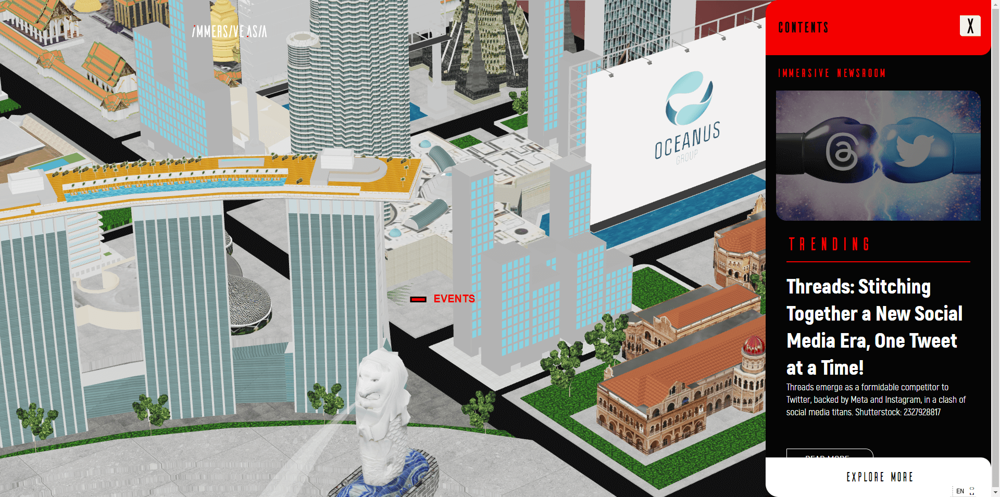
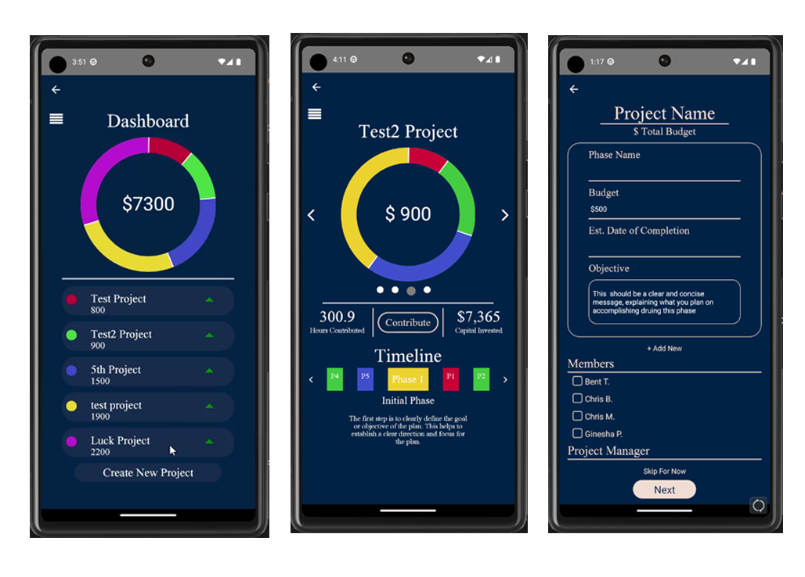
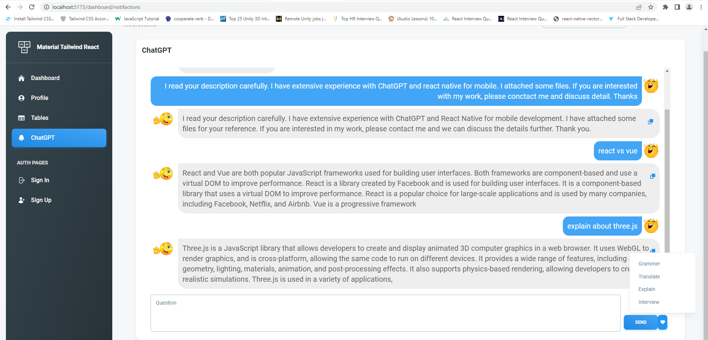
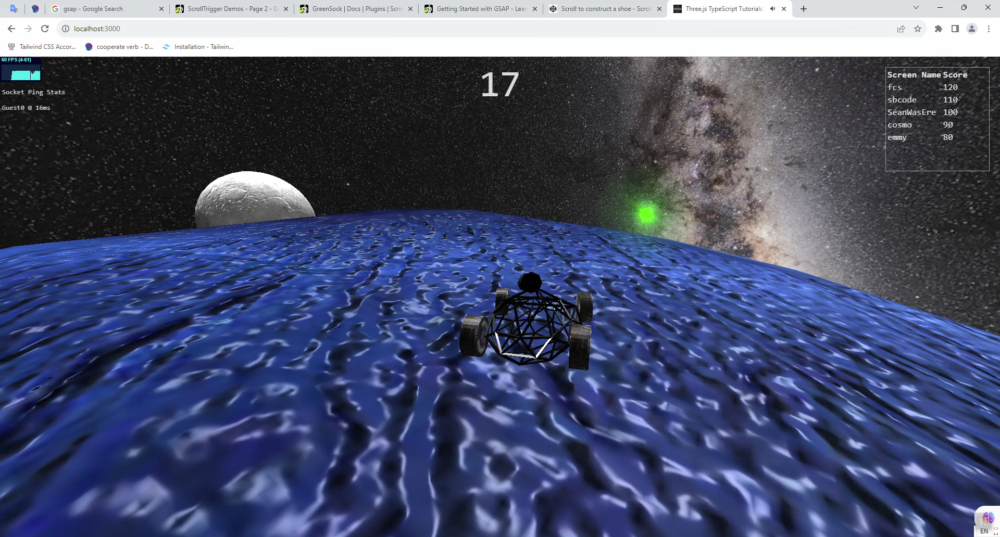

<!--
**LucktoSky/LucktoSky** is a ✨ _special_ ✨ repository because its `README.md` (this file) appears on your GitHub profile.

Here are some ideas to get you started:

- 🔭 I’m currently working on ...
- 🌱 I’m currently learning ...
- 👯 I’m looking to collaborate on ...
- 🤔 I’m looking for help with ...
- 💬 Ask me about ...
- 📫 How to reach me: ...
- 😄 Pronouns: ...
- ⚡ Fun fact: ...
-->

<h1 style="text-align: center;">👋 Hello everyone 👋</h1>

I am a Full Stack Developer with five years of professional experience, specializing in web development, project management, agile methodology, and quality assurance testing. Adept at coordinating effectively with development teams, clients, and nontechnical stakeholders to execute complex web development projects. 

<table>
    <tr>
        <td></td>
        <td></td>
    </tr>
</table>

## My personal values and work ethic
✨ I want to build strong relationships with my clients.

✨ I believe that a good working relationship is built on mutual trust and respect.

✨ I value open communication and strive to keep you updated on progress every step of the way.

✨ I am a team player and enjoy collaborating with others to achieve a common goal.

✨ Outside of work, I am an avid sports fan, especially when it comes to football.

✨ I enjoy learning new technologies and am constantly seeking opportunities to expand my skillset.

  
- 🌱 I’m currently building business websites using Next.js, Typescript, Tailwind CSS.  
  
- ❓ Ask me about anything related to MERN stack and related technologies  
  
- ⚡ Fun fact: I keep night shift swithed on at all times   
## My past work
<table>
    <tr>
        <td></td>
        <td></td>
        <td></td>
    </tr>
    <tr>
        <td></td>
        <td></td>
        <td></td>
    </tr>
    <tr>
        <td></td>
        <td></td>
        <td></td>
    </tr>
</table>
